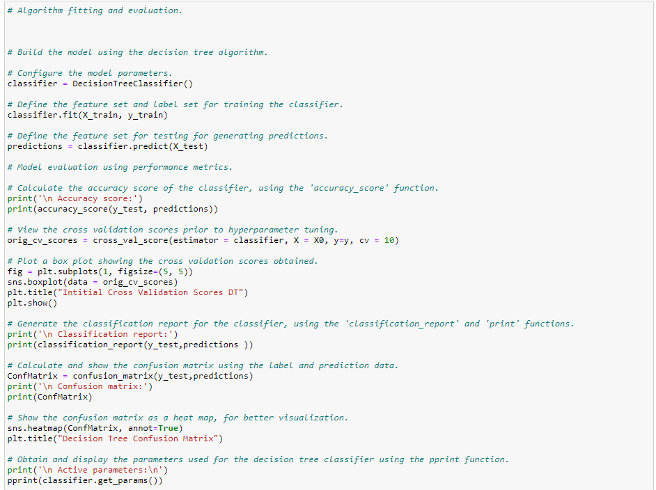
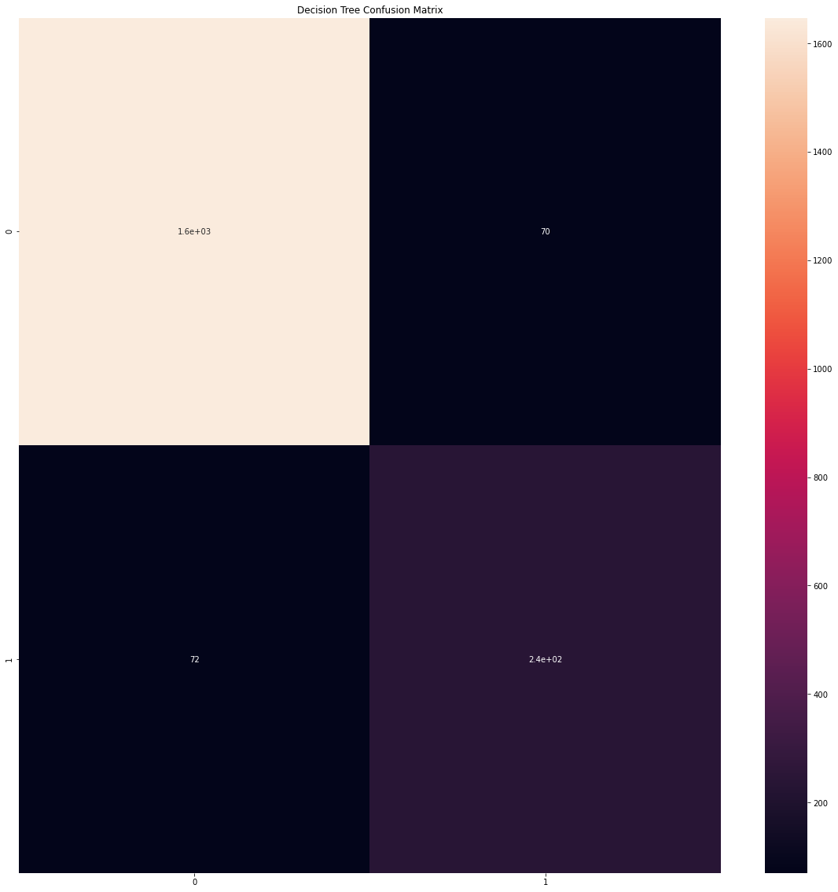
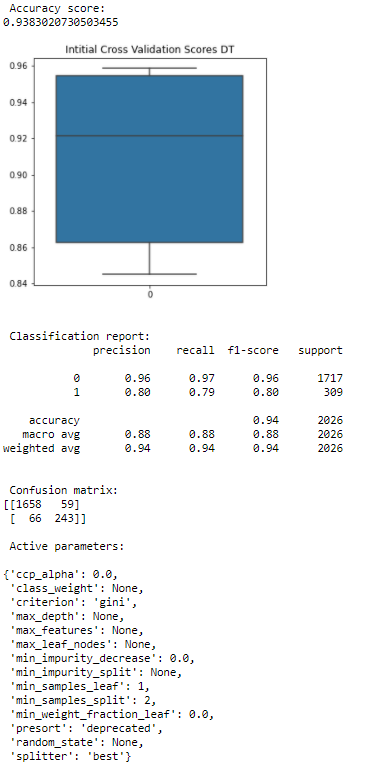
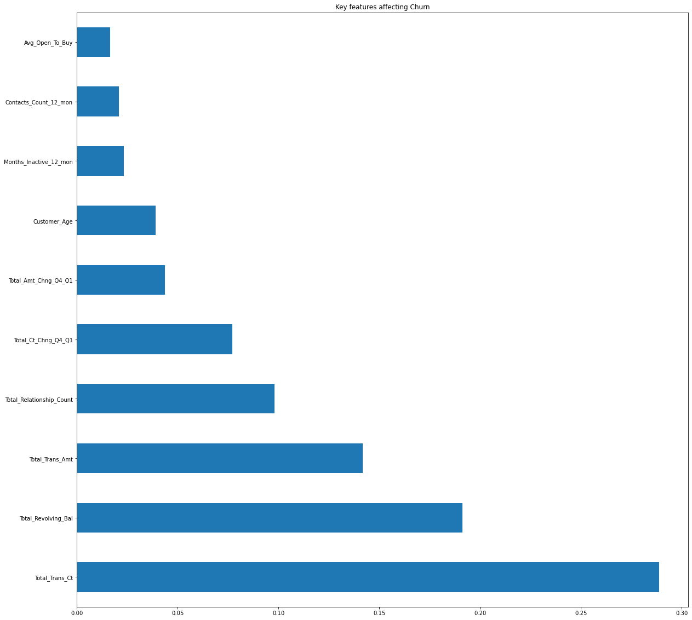

# Bank Customer Churn: Predictive Modeling & Analysis
Predicting customer defection using Random Forest and Decision Tree classifiers.

---

## 📌 Project Overview
This project addresses the challenge of predicting client churn to help banks assess risk and improve customer retention. Using a dataset of **10,127 clients**, I developed a machine learning pipeline to identify key factors influencing bank turnover.

---

## 🛠 Data Synthesis & Preprocessing
To ensure model integrity and computational efficiency, I performed the following steps:

* **Null Value Handling:** Used `.isnull().sum()` and `.dropna()` methods to verify and ensure zero missing values within the dataset.
* **Feature Pruning:** Identified and removed redundant columns, including the unique `CLIENTNUM` and two Naïve Bayes classifier columns provided by the original dataset author.

---

## 🔍 Data Inspection & Distribution
Before engineering features, I inspected the underlying structure and class balance of the dataset:

* **Statistical Summary:** Utilized `.describe()` and `.info()` to identify variable types and check for anomalies in the numeric features.
* **Class Balance Check:** Performed `.value_counts()` on categorical columns to understand the distribution of the target label (`Attrition_Flag`) and other key demographics like `Income_Category` and `Education_Level`.

---

## 🧬 Feature Engineering & Categorical Encoding
To prepare the data for the Random Forest and Decision Tree classifiers, I transformed text-based categories into numerical formats:

* **Ordinal Encoding:** Manually mapped ranked variables such as `Education_Level`, `Income_Category`, and `Card_Category` to a numeric scale (e.g., Graduate = 4, Doctorate = 6).
* **One-Hot Encoding:** Used `pd.get_dummies` for nominal variables like `Gender` and `Marital_Status` to create binary identifiers.
* **Data Integration:** Concatenated the newly encoded features back into the primary dataframe and removed the original text columns to finalize the feature set.

---

## 📊 Exploratory Data Analysis (EDA) & Visualization
To understand the underlying drivers of churn, I utilized **Seaborn** and **Matplotlib** to visualize correlations and distributions across the 10,000+ customer records.

* **Correlation Heatmap:** Generated a comprehensive heatmap to identify strong associations, such as the relationship between `Credit_Limit` and `Avg_Open_To_Buy`.
* **Feature Distributions:** Plotted histograms for all variables to identify skewness. While `Age` showed a unimodal distribution, features like `Total_Trans_Amt` exhibited left-skewed multimodal patterns.
* **Churn Drivers (Box Plots):** Analysis revealed that customers with low average utilization ratios and low transaction counts/amounts were at the highest risk of leaving the bank.
* **Demographic Impact:** Evaluation indicated that customers earning less than $40K annually and those with three or fewer dependents were key attrition segments.

### EDA Gallery

| Correlation Heatmap | Label Distribution |
| :---: | :---: |
|  |  |
| *Identifying strong associations between features* | *Visualizing the 5.25:1 data imbalance* |

| Transaction Amounts | Transaction Counts | Demographic Impact |
| :---: | :---: | :---: |
|  |  |  |
| *Total Transaction Amounts* | *Total Transaction Counts* | *Impact of Gender/Income* |
---

## 📏 Data Slicing & Feature Scaling
To ensure the machine learning models could generalize to new data, I implemented a rigorous preparation pipeline:

* **Feature/Label Isolation:** Separated the target variable (`Attrited Customer`) from the feature set.
* **Feature Scaling:** Implemented `StandardScaler` to normalize the feature set, ensuring features with larger numerical ranges (like `Credit_Limit`) do not disproportionately influence the model.
* **Train-Test Split:** Sliced the data into training and testing sets using an **80/20 split** with a `random_state` of 0 for reproducibility.

---

## 🤖 Machine Learning Implementation & Evaluation
I implemented and evaluated a **Random Forest Classifier** for its robustness against data imbalance and ability to rank feature importance.

### Model Training & Benchmarking
* **Algorithm Selection:** Built the primary model using `RandomForestClassifier`.
* **Baseline Scoring:** Performed **Tenfold Cross-Validation** to assess variance and reliability.
* **Performance Metrics:** Automated evaluation using `accuracy_score`, `classification_report`, and `confusion_matrix`.

### Random Forest Results
* **Accuracy:** The model achieved an initial accuracy of **95.31%** on the test set.
* **Predictive Success:** Correctly identified **1,931 outcomes** (1,695 true positives and 236 true negatives) out of 2,026 test cases.

---

## 💡 Feature Importance & Business Insights
A primary objective was to determine variables most heavily influencing customer defection using the Random Forest algorithm's native ranking capability.

* **Top 3 Predictors:**
    1.  **Total Transaction Amount:** The most significant predictor of churn.
    2.  **Total Transaction Count:** Frequency of account use was highly correlated with retention.
    3.  **Total Revolving Balance:** Lower balances showed a higher propensity for attrition.

---

## 🌳 Comparative Analysis: Decision Tree Classifier
I implemented a **Decision Tree Classifier** as a baseline for performance comparison.

* **Implementation:** Initialized with default parameters.
* **Accuracy:** Achieved **93.83%**, slightly lower than the Random Forest's 95.31%.
* **Validation:** Tenfold Cross-Validation showed higher variance in scores compared to the ensemble method.

### Decision Tree Metrics
* **Confusion Matrix:** Correctively predicted 1,658 non-churning and 243 churning customers.
* **Weighted F1-Score:** 0.94, confirming strong predictive power but validating Random Forest as the superior model.

---

## 🏁 Conclusion & Recommendations
The comparative results confirm that while the Decision Tree is effective, the **Random Forest** provides superior accuracy and stability for this dataset. Both models consistently identified transaction count and revolving balance as the primary churn drivers.

**Recommendation:** The bank should focus CRM efforts on high-value customers who frequently perform sizable transactions. These regular users represent the highest risk for attrition if their engagement levels drop.

Full project available at [Bank Churn.docx](Bank-Churn.docx)
