# Bank-Churn-Predictive-Analytics
Predicting customer defection using Random Forest and Decision Tree classifiers.

Bank Customer Churn: Predictive Modeling & Analysis 

Project Overview 

This project addresses the challenge of predicting client churn to help banks assess risk and improve customer retention. Using a dataset of 10,127 clients, I developed a machine learning pipeline to identify key factors influencing bank turnover.

Data Synthesis & Preprocessing

To ensure model integrity and computational efficiency, I performed the following steps:

Null Value Handling: Used the .isnull().sum() and .dropna() methods to verify and ensure zero missing values within the dataset.
Feature Pruning: Identified and removed redundant columns, including the unique CLIENTNUM and two Naïve Bayes classifier columns provided by the original dataset author.

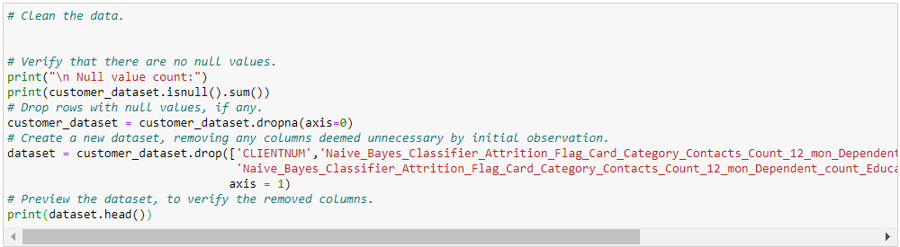

Data Inspection & Distribution

Before engineering features, I inspected the underlying structure and class balance of the dataset.

Statistical Summary: Utilized .describe() and .info() to identify variable types and check for anomalies in the numeric features.

Class Balance Check: Performed .value_counts() on categorical columns to understand the distribution of the target label (Attrition_Flag) and other key demographics like Income_Category and Education_Level.

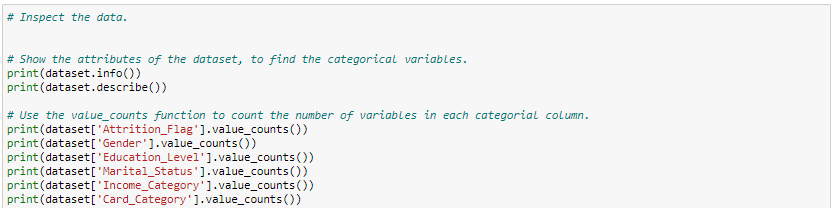

Feature Engineering & Categorical Encoding

To prepare the data for the Random Forest and Decision Tree classifiers, I transformed text-based categories into numerical formats.

Ordinal Encoding: Manually mapped ranked variables such as Education_Level, Income_Category, and Card_Category to a numeric scale (e.g., Graduate = 4, Doctorate = 6).

One-Hot Encoding: Used pd.get_dummies for nominal variables like Gender and Marital_Status to create binary identifiers, ensuring the model treats them as distinct categories without an inherent rank.

Data Integration: Concatenated the newly encoded features back into the primary dataframe and removed the original text columns to finalize the feature set.

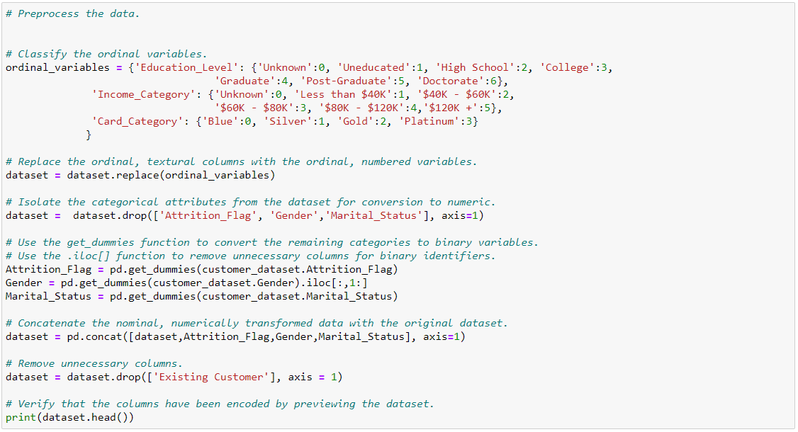

Exploratory Data Analysis (EDA) & Visualization

To understand the underlying drivers of churn, I utilized Seaborn and Matplotlib to visualize correlations and distributions across the 10,000+ customer records.

Correlation Heatmap: Generated a comprehensive heatmap to identify strong associations, such as the relationship between Credit_Limit and Avg_Open_To_Buy.

Feature Distributions: Plotted histograms for all variables to identify skewness. While Age showed a unimodal distribution, features like Total_Trans_Amt exhibited left-skewed multimodal patterns.

Churn Drivers (Box Plots): Analyzed the impact of transactional behavior on attrition. The analysis revealed a consistent pattern: customers with low average utilization ratios and low transaction counts/amounts were at the highest risk of leaving the bank.

Demographic Impact: Evaluated Gender, Income_Category, and Marital_Status using count plots. Findings indicated that customers earning less than $40K annually and those with three or fewer dependents were key attrition segments.

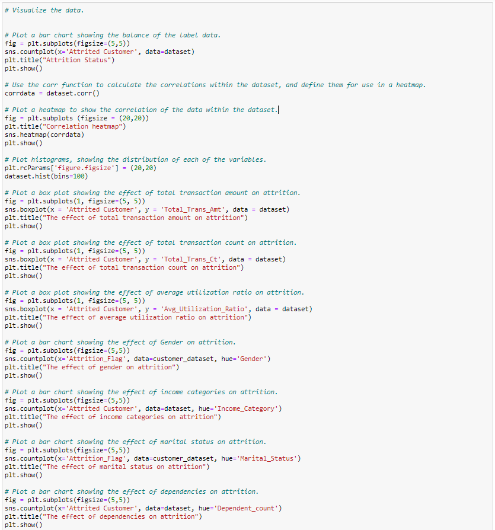

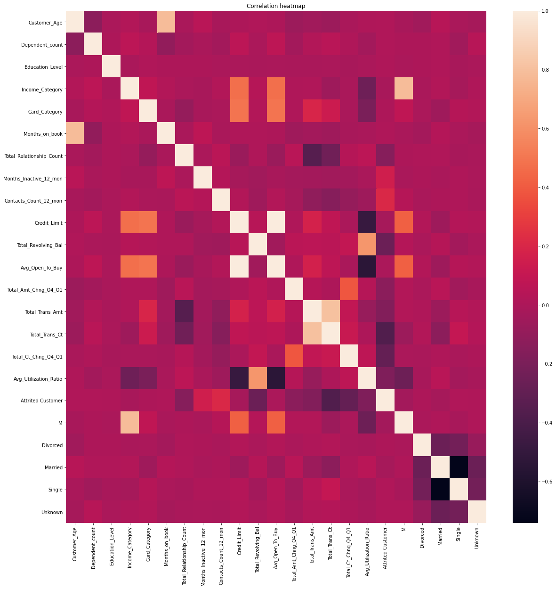

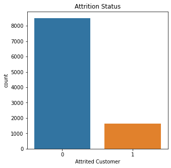

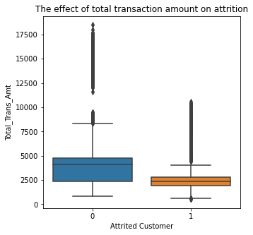

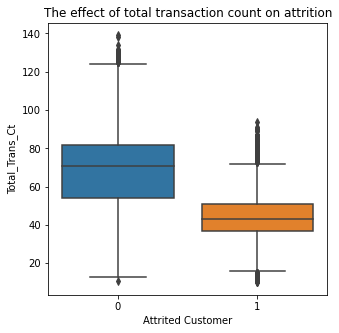

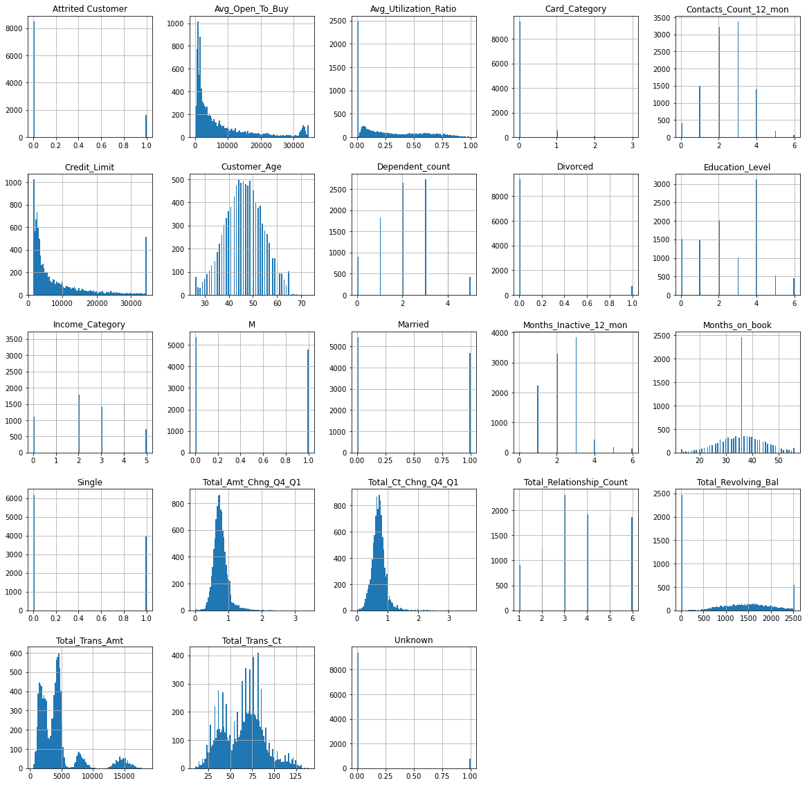

Data Slicing & Feature Scaling

To ensure the machine learning models could generalize to new data, I implemented a rigorous data preparation pipeline:

Feature/Label Isolation: Separated the target variable (Attrited Customer) from the feature set to create the X and y arrays.

Feature Scaling: Implemented StandardScaler to normalize the feature set. This ensures that features with larger numerical ranges (like Credit_Limit) do not disproportionately influence the model compared to smaller ranges.

Train-Test Split: Sliced the data into training and testing sets using a 80/20 split. I utilized a random_state of 0 to ensure the results are reproducible across different runs.

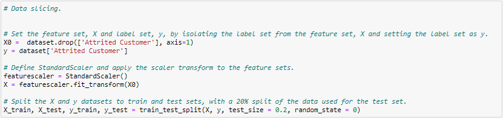

Machine Learning Implementation & Evaluation

After finalizing the feature engineering, I implemented and evaluated a Random Forest Classifier to predict customer churn. Random Forest was selected for its robustness against data imbalance and its ability to rank feature importance.

Model Training & Benchmarking

Algorithm Selection: Built the primary model using the RandomForestClassifier with a random_state of 0 to ensure consistent results.

Baseline Scoring: Performed Tenfold Cross-Validation on the base model to assess variance and reliability across different subsets of the data.

Performance Metrics: Automated the evaluation process using Scikit-learn’s accuracy_score, classification_report, and confusion_matrix.

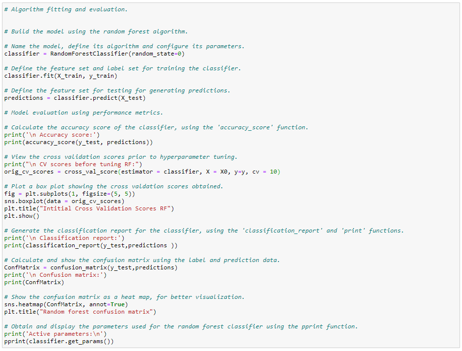

Results

After executing the above script the results were obtained as shown.

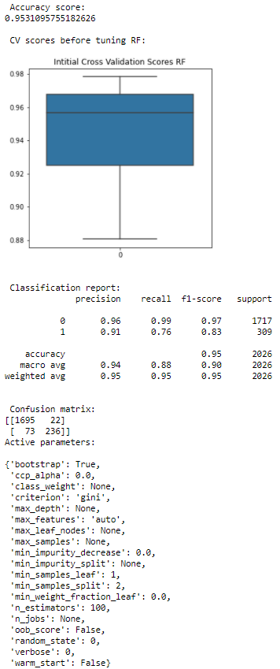

Key Results
Accuracy: The model achieved an initial accuracy of 95.31% on the test set.

Predictive Success: Out of 2,026 test cases, the classifier correctly identified 1,931 outcomes (1,695 true positives and 236 true negatives).

Confusion Matrix Visualization: Generated a heatmap for the confusion matrix to provide a clear visual representation of the model's precision and recall across both classes.

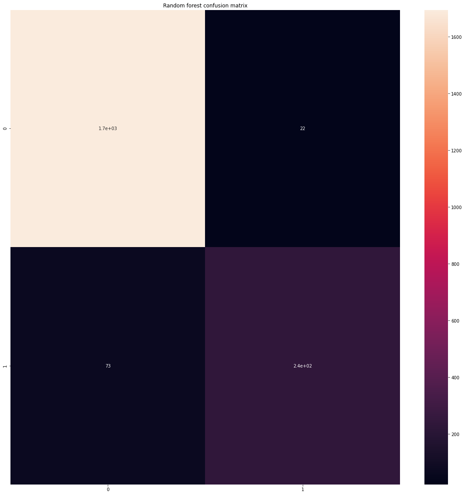

Feature Importance & Business Insights

A primary objective of this project was to determine which variables most heavily influence a customer's decision to leave the bank. Using the Random Forest algorithm's native capability to rank features, I extracted the top 10 indicators of churn.

Identifying Key Drivers: Utilized the .feature_importances_ attribute to quantify the impact of each variable on the model's predictive accuracy.

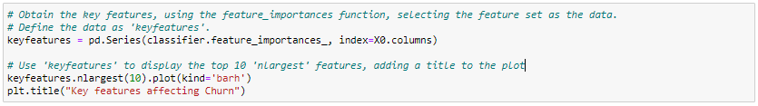

Visualization: Transformed the feature importance data into a Horizontal Bar Chart using nlargest(10).plot(kind='barh') to provide a clear, rank-ordered view of churn drivers.

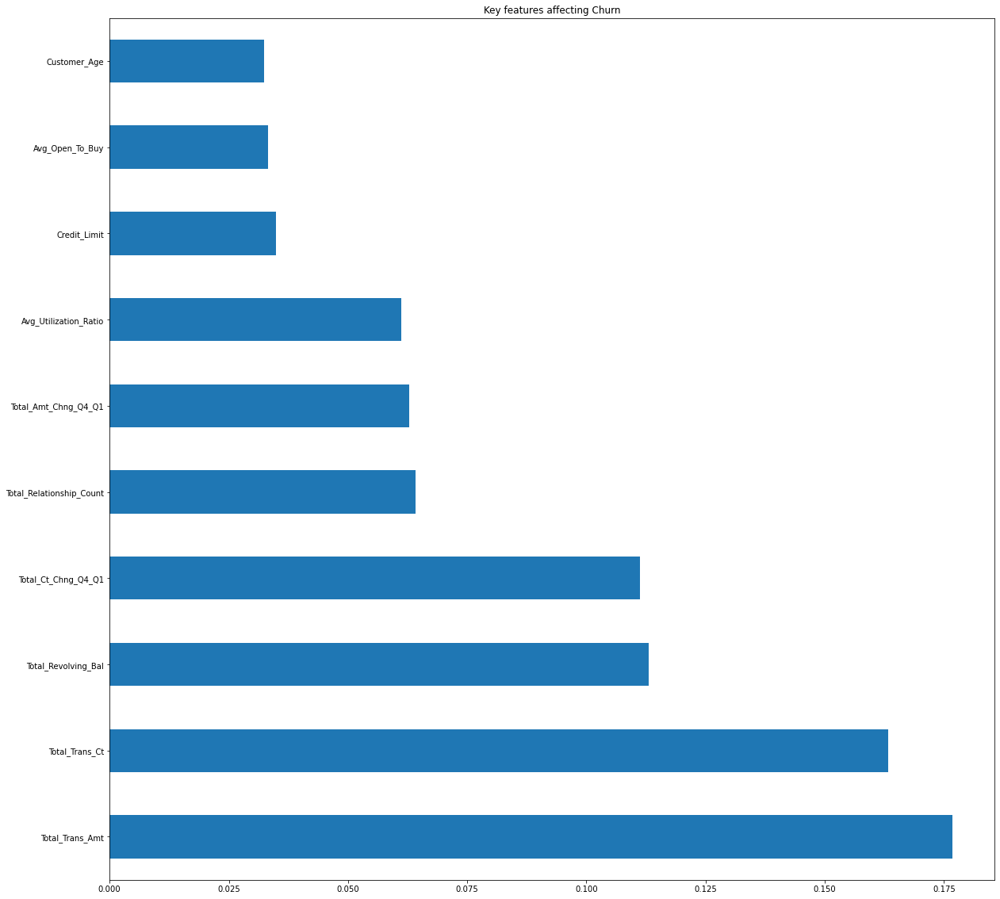

Analytical Results

The analysis identified the top three characteristics influencing bank turnover as:

Total Transaction Amount: The most significant predictor of churn.

Total Transaction Count: Frequency of account use was highly correlated with retention.

Total Revolving Balance: Customers maintaining lower balances showed a higher propensity for attrition.

Feature Importance & Business Insights

A primary objective of this project was to determine which variables most heavily influence a customer's decision to leave the bank. Using the Random Forest algorithm's native capability to rank features, I extracted the top 10 indicators of churn.

Identifying Key Drivers: Utilized the .feature_importances_ attribute to quantify the impact of each variable on the model's predictive accuracy.

Visualization: Transformed the feature importance data into a Horizontal Bar Chart using nlargest(10).plot(kind='barh') to provide a clear, rank-ordered view of churn drivers.

Analytical Results

The analysis identified the top three characteristics influencing bank turnover as:

Total Transaction Amount: The most significant predictor of churn.

Total Transaction Count: Frequency of account use was highly correlated with retention.

Total Revolving Balance: Customers maintaining lower balances showed a higher propensity for attrition.

Conclusion & Recommendations

Based on these findings, it is recommended that the bank focus its CRM efforts on high-value customers who frequently perform sizable transactions. These regular users represent the highest risk for attrition if their engagement levels drop.
